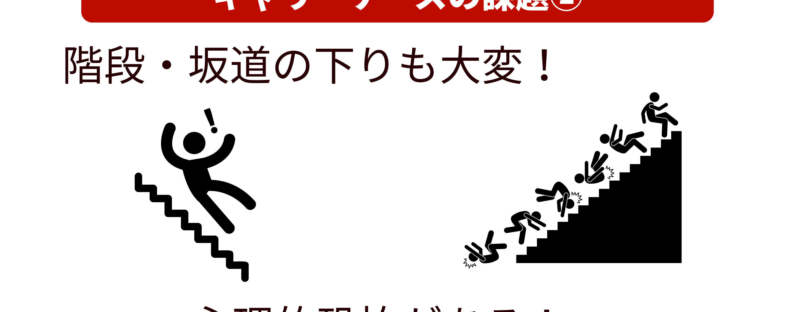
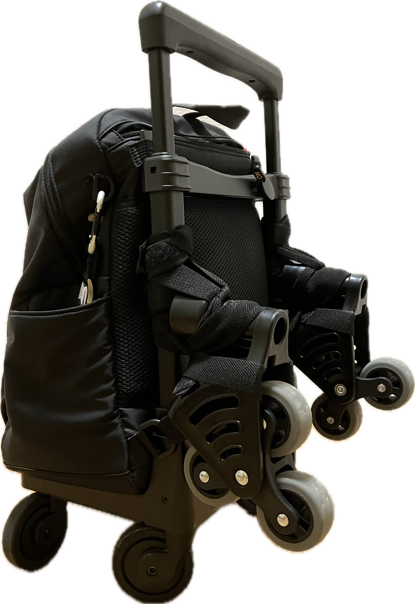
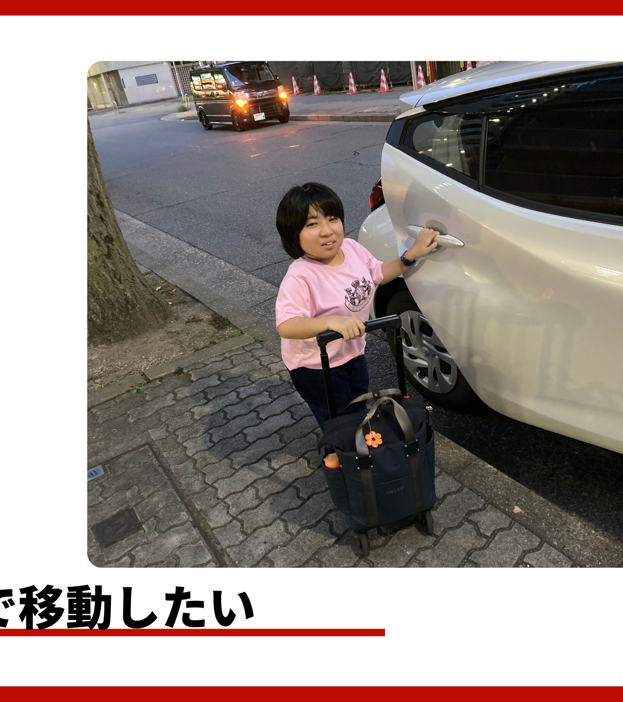

# FitWith Carry-Assist プロダクトサイト 統合開発指示書

## 📋 プロジェクト統合の方針

本指示書は、以下2つのプロジェクトの優れた要素を統合し、**最高のユーザー体験**と**購入意欲の最大化**を実現するものです：

1. **FitWithプロダクトサイト**: ユーザー視点のマーケティング戦略、実写素材、共感重視のコンテンツ
2. **キャリーケースアシスト**: Three.js 3Dモデル、インタラクティブな製品可視化、技術的革新性

---

## 🎯 統合プロジェクトの目的

**「諦めない自由な移動」**を実現する製品の価値を、**視覚的・感情的・技術的**に訴求し、ターゲットユーザー（足腰に不安のある方やそのご家族）の**共感と信頼**を獲得し、**購入行動**へと導く。

### ターゲット顧客
- 階段や段差の移動に不安を感じる高齢者
- 障がいをお持ちの方
- キャリーケースを日常的に使用される方
- そのご家族や介護者

---

## 🏗️ サイト構成（5ページ + 3D体験）

### 🏠 `index.html` - トップページ（統合版）

**【目的】** ユーザーが「これは私のための製品だ」と直感し、製品の革新性を体感できるLPに進化

#### 1. ヒーローセクション（画像背景 + 強力なメッセージ）
```html
<section class="hero-section">
  <div class="hero-image-container">
    
    <div class="hero-overlay"></div>
  </div>
  <div class="hero-content">
    <h1>すべての人が、自分のタイミングで・自力で・自由に移動できる世界へ</h1>
    <p>愛用のキャリーケースに後付けできる『Carry-Assist』<br>
    段差・階段の昇降をもっと楽に、もっと安全に。</p>
    <a href="#3d-experience" class="cta-button">製品を360°体験する</a>
  </div>
</section>
```

**【実装指示】**
- 背景画像: `images/hero-background.jpg`（製品使用シーンの静止画）
- 画像の上にオーバーレイを配置し、テキストの読みやすさを確保
- レスポンシブ対応で、モバイルでも美しく表示

#### 2. 悩みへの共感セクション（絵文字 + ピクトグラム）
```html
<section class="empathy-section">
  <h2>そのキャリーケース、「怖い」「大変」と感じたことはありませんか？</h2>
  
  <div class="empathy-cards">
    <div class="empathy-card">
      <div class="problem-side">
        <div class="problem-icon">😰</div>
        
        <h3>階段での恐怖</h3>
        <p>重いキャリーケースが階段で制御できず、転倒しそうになった経験…</p>
      </div>
      <div class="solution-side">
        <div class="solution-icon">✨</div>
        <h3>こう変わります</h3>
        <p>3輪タイヤとブレーキが段差をスムーズにサポート。恐怖から解放されます。</p>
      </div>
    </div>
    <!-- 他のカードも同様の構造 -->
  </div>
</section>
```

**【実装指示】**
- PDF `【完成に向けて】 STAPS最終ピッチ.pdf` P.13のピクトグラムを抽出して `images/pictogram_fall.png` として使用
- 絵文字とピクトグラムを組み合わせ、視覚的インパクトを強化
- 問題→解決のBefore/After形式で共感を醸成

#### 3. 🎨 **革新的3D体験セクション（Three.js統合）**
```html
<section id="3d-experience" class="canvas-section">
  <div class="section-header">
    <h2>製品を360°体験してみましょう</h2>
    <p>マウスを動かして、Carry-Assistのすべてを確認できます</p>
  </div>
  
  <div class="canvas-container" id="canvas-container">
    <div class="loading-indicator" id="loading">3Dモデルを読み込み中...</div>
    <canvas id="three-canvas"></canvas>
    <div class="interaction-hint">
      <span>🖱️ マウスを動かして製品を回転</span>
      <span>📱 スワイプで操作</span>
    </div>
    
    <!-- ホットスポット機能 -->
    <div class="hotspot" data-feature="motor" style="left: 45%; top: 60%;">
      <div class="hotspot-marker">+</div>
      <div class="hotspot-popup">
        <h4>⚡ アシスト機構</h4>
        <p>坂道や階段もサポート。軽い力で楽に移動可能。</p>
      </div>
    </div>
    
    <div class="hotspot" data-feature="wheel" style="left: 30%; top: 80%;">
      <div class="hotspot-marker">+</div>
      <div class="hotspot-popup">
        <h4>多方向移動タイヤ</h4>
        <p>3輪タイヤで段差をスムーズに乗り越え。安定性抜群。</p>
      </div>
    </div>
    
    <div class="hotspot" data-feature="brake" style="left: 55%; top: 75%;">
      <div class="hotspot-marker">+</div>
      <div class="hotspot-popup">
        <h4>安全ブレーキ</h4>
        <p>下り坂でも安心。速度を自動制御します。</p>
      </div>
    </div>
  </div>
  
  <!-- 背景アニメーション：困難な道→スムーズな道 -->
  <div class="background-animation">
    <svg class="obstacle-path" viewBox="0 0 1200 300">
      <path d="M0,150 Q300,50 600,150 T1200,150" stroke="#e0e0e0" stroke-width="3" fill="none" opacity="0.3"/>
      <path class="smooth-path" d="M0,150 L1200,150" stroke="#38a169" stroke-width="3" fill="none" opacity="0"/>
    </svg>
  </div>
</section>
```

**【実装指示】**
- Three.js (CDN: r128) を使用した3Dキャリーケースモデル
- マウス/タッチ操作で360°回転可能
- アシスト機構、タイヤ、ブレーキ部分に**クリック可能なホットスポット**を配置
- ホットスポットクリックで詳細情報のポップアップ表示
- 背景アニメーション: マウス移動に連動して「困難な道」→「スムーズな道」に変化
- 車輪は回転アニメーション
- ローディング表示を実装

#### 4. 喜びの体験セクション（実写 + 3D連動）
```html
<section class="joy-section">
  <h2>その悩み、愛用のカートに「付けるだけ」で、驚くほど軽やかに。</h2>
  
  <div class="joy-cards">
    <div class="joy-card">
      
      <h3>🚶‍♀️ 坂道も階段も、まるで平地のように</h3>
      <p>3輪タイヤとアシスト機構で、坂道も楽々。<br>
      「今まで避けていた場所に、行けるようになった」</p>
      <a href="#3d-experience" class="view-3d-link">3Dで機能を確認 →</a>
    </div>
    
    <div class="joy-card">
      
      <h3>🛡️ 安心のブレーキで、下り坂も怖くない</h3>
      <p>速度をコントロールするブレーキ機能。急な坂でも、安全に降りられます。</p>
      <a href="product.html#brake" class="detail-link">ブレーキ詳細 →</a>
    </div>
    
    <div class="joy-card">
      
      <h3>🔧 工具不要！わずか3分で取り付け</h3>
      <p>お持ちのキャリーケースに、ベルトで固定するだけ。<br>
      専門知識は一切不要です。</p>
      <a href="product.html#howto" class="detail-link">使い方を見る →</a>
    </div>
  </div>
</section>
```

**【実装指示】**
- `images/prototype.jpg` (変換元: `プロトタイプ.heic`)
- 静止画像のみを使用し、ページの読み込み速度を最適化
- 3D体験セクションへのリンクを設置し、ページ内回遊を促進

#### 5. 顧客の声セクション（Social Proof + 実写画像）
```html
<section class="testimonial-section">
  <h2>先に体験した方々から、喜びの声が届いています。</h2>
  <div class="satisfaction-rate">
    <span class="rate-number">87.6%</span>
    <span class="rate-text">の方が<br>ポジティブな感想</span>
  </div>
  
  <div class="testimonial-image">
    
    <p class="image-caption">実際の利用シーン：階段をスムーズに昇降</p>
  </div>
  
  <div class="testimonial-cards">
    <div class="testimonial-card">
      <div class="testimonial-avatar">👵</div>
      <p class="testimonial-text">「買い物の帰り道、坂道が怖くなくなりました」</p>
      <span class="testimonial-author">70代女性</span>
    </div>
    <!-- 他の声も同様 -->
  </div>
</section>
```

**【実装指示】**
- 87.6%の満足度を大きく表示
- 実際の利用シーンの静止画像を配置
- 顧客の声は温かみのあるカードデザイン

#### 6. CTAセクション
```html
<section class="cta-section">
  <h2>さあ、あなたも「自由な移動」を体験しませんか？</h2>
  <p>製品に関するご質問、デモンストレーションのご希望など、お気軽にお問い合わせください</p>
  <div class="cta-buttons">
    <a href="contact.html" class="cta-button primary">まずは製品について相談してみる</a>
    <a href="product.html" class="cta-button secondary">詳しい機能を見る</a>
  </div>
</section>
```

---

### 🔧 `product.html` - 製品詳細（3D統合版）

**【目的】** 購入検討者の具体的な疑問を解消し、製品への信頼を構築

#### 1. 製品ヒーロー（3Dモデル + 実写）
```html
<section class="product-hero">
  <div class="product-hero-left">
    <!-- ミニ3Dビューワー -->
    <div class="mini-3d-viewer" id="product-3d">
      <canvas id="product-canvas"></canvas>
    </div>
  </div>
  <div class="product-hero-right">
    <h1>Carry-Assist<br>製品詳細</h1>
    <p class="product-tagline">愛用のキャリーケースを、アシスタントに変える後付けユニット</p>
    <ul class="key-features">
      <li>✅ 最大20kgの荷物をサポート</li>
      <li>✅ 軽量設計: 約2.0kg</li>
      <li>✅ 工具不要で3分取り付け</li>
      <li>✅ ほとんどのケースに対応</li>
    </ul>
  </div>
</section>
```

#### 2. インタラクティブ機能紹介
```html
<section class="interactive-features">
  <h2>3つの核心機能</h2>
  
  <div class="feature-interactive">
    <div class="feature-left">
      <div class="feature-selector">
        <button class="feature-btn active" data-feature="assist">
          <span class="feature-icon">⚡</span>
          アシスト機構
        </button>
        <button class="feature-btn" data-feature="wheel">
          <span class="feature-icon">🎯</span>
          3輪タイヤ
        </button>
        <button class="feature-btn" data-feature="brake">
          <span class="feature-icon">🛡️</span>
          安全ブレーキ
        </button>
      </div>
    </div>
    
    <div class="feature-right">
      <!-- 選択された機能に応じて3Dモデルがズーム＆ハイライト -->
      <div class="feature-3d-detail" id="feature-3d"></div>
      
      <div class="feature-description" data-feature="assist">
        <h3>機械的アシスト機構</h3>
        <p>坂道や階段での負担を大幅に軽減。軽い力で、重い荷物を楽々運べます。</p>
        
      </div>
      <!-- 他の機能も同様 -->
    </div>
  </div>
</section>
```

**【実装指示】**
- ボタンクリックで3Dモデルが該当パーツにズーム＆ハイライト
- 各機能の詳細画像を静止画で表示
- スムーズなトランジション効果

#### 3. かんたん！3ステップの使い方
```html
<section id="howto" class="howto-section">
  <h2>工具不要！わずか3分で取り付け</h2>
  
  <div class="howto-steps">
    <div class="howto-step">
      <div class="step-number">1</div>
      
      <h3>ベルトで固定</h3>
      <p>お持ちのキャリーケースに、本体をベルトで固定します</p>
    </div>
    
    <div class="howto-step">
      <div class="step-number">2</div>
      
      <h3>位置調整</h3>
      <p>最適な位置に調整して、しっかり固定</p>
    </div>
    
    <div class="howto-step">
      <div class="step-number">3</div>
      
      <h3>快適な移動</h3>
      <p>あとは普段通り。軽やかに移動できます</p>
    </div>
  </div>
</section>
```

#### 4. スペック表（視覚的に）
```html
<section class="specs-section">
  <h2>製品仕様</h2>
  <div class="specs-grid">
    <div class="spec-card">
      <div class="spec-icon">📏</div>
      <h3>サイズ</h3>
      <p>W300 × H450 × D150 mm</p>
    </div>
    <div class="spec-card">
      <div class="spec-icon">⚖️</div>
      <h3>重量</h3>
      <p>約2.0kg</p>
    </div>
    <div class="spec-card">
      <div class="spec-icon">🎯</div>
      <h3>対応キャリーケース</h3>
      <p>高さ50〜70cm、幅35〜45cm</p>
    </div>
    <div class="spec-card">
      <div class="spec-icon">💪</div>
      <h3>耐荷重</h3>
      <p>最大20kg</p>
    </div>
    <div class="spec-card">
      <div class="spec-icon">🛠️</div>
      <h3>材質</h3>
      <p>アルミニウム合金、樹脂</p>
    </div>
    <div class="spec-card">
      <div class="spec-icon">✅</div>
      <h3>保証</h3>
      <p>1年間製品保証</p>
    </div>
  </div>
</section>
```

#### 5. Q&Aセクション（アコーディオン）
```html
<section class="faq-section">
  <h2>よくあるご質問</h2>
  
  <div class="faq-list">
    <div class="faq-item">
      <button class="faq-question">
        
        <span>どんなキャリーケースでも使えますか？</span>
        <span class="faq-toggle">+</span>
      </button>
      <div class="faq-answer">
        <p>はい、ほとんどの2輪・4輪キャリーケースに対応しています。
        対応サイズ: 高さ50cm〜70cm、幅35cm〜45cm</p>
      </div>
    </div>
    <!-- 他のQ&Aも同様 -->
  </div>
</section>
```

**【実装指示】**
- `images/character_icon.png` (変換元: `geminiで作ったキャラクター.jpg`)
- アコーディオン形式で開閉
- 親しみやすいキャラクターアイコン

---

### 💭 `mission.html` - 開発ストーリー

**【目的】** 製品への信頼と共感を深める物語

#### 1. 代表の原体験
```html
<section class="story-hero">
  <div class="story-image">
    
  </div>
  <div class="story-content">
    <h1>「自力で移動したい」<br>その想いから、すべてが始まった</h1>
    <p class="story-lead">
      代表・小代の切実な原体験が、この製品を生み出しました。<br>
      「階段が怖い」「人に迷惑をかけたくない」<br>
      そんな想いを抱える方々に、自由な移動を届けたい。
    </p>
  </div>
</section>
```

**【実装指示】**
- PDF P.4の写真を `images/story_koshiro.jpg` として使用

#### 2. Before/After画像比較
```html
<section class="before-after">
  <h2>製品がない場合 vs ある場合</h2>
  
  <div class="comparison-images">
    <div class="comparison-image">
      <h3>Before: 製品なし</h3>
      
      <p>階段を上るだけで、これだけの労力が…</p>
    </div>
    
    <div class="comparison-image">
      <h3>After: Carry-Assist使用</h3>
      
      <p>スムーズに、安全に昇降できます</p>
    </div>
  </div>
</section>
```

**【実装指示】**
- Before/Afterの画像を並列に配置
- 視覚的に違いがわかりやすいレイアウト

#### 3. 調査結果
```html
<section class="research-section">
  <h2>80%の方が「自力で移動したい」</h2>
  <div class="research-chart">
    <!-- 視覚的なチャート表示 -->
  </div>
  <p>同じ悩みを持つ多くの方々の声が、開発の原動力になりました。</p>
</section>
```

---

### 📢 `news.html` - お知らせ

**【既存を維持】** STAPS賞受賞など、最新情報を掲載

---

### 📧 `contact.html` - お問い合わせ

**【既存を維持】** ユーザー向けのシンプルな問い合わせフォーム

---

## 🎨 デザインシステム（統合版）

### カラーパレット
- **プライマリ（信頼）**: `#2563eb` (青)
- **セカンダリ（成長）**: `#38a169` (緑) - アシスト機能のハイライト
- **アクセント（強調）**: `#4CAF50` (緑) - 3Dモデルのエミッシブライト
- **背景**: `#f8f9fa` (ライトグレー)
- **テキスト**: `#333333` (濃いグレー)

### タイポグラフィ
```css
@import url('https://fonts.googleapis.com/css2?family=Noto+Sans+JP:wght@300;400;700&display=swap');

body {
  font-family: 'Noto Sans JP', sans-serif;
  line-height: 1.8;
  color: #333;
}

h1 { font-size: 3.5rem; font-weight: 700; }
h2 { font-size: 2.5rem; font-weight: 700; }
h3 { font-size: 1.5rem; font-weight: 400; }
```

### アニメーション
```css
/* スクロールアニメーション */
.fade-in {
  opacity: 0;
  transform: translateY(30px);
  transition: opacity 0.8s ease, transform 0.8s ease;
}

.fade-in.visible {
  opacity: 1;
  transform: translateY(0);
}

/* ホバーエフェクト */
.hover-lift {
  transition: transform 0.3s ease, box-shadow 0.3s ease;
}

.hover-lift:hover {
  transform: translateY(-5px);
  box-shadow: 0 10px 25px rgba(0,0,0,0.15);
}
```

---

## 💻 技術実装指示

### Three.js 3Dモデル実装

**ファイル**: `scripts/three-viewer.js`

```javascript
// 基本設定
const scene = new THREE.Scene();
scene.background = null; // 透過背景

const camera = new THREE.PerspectiveCamera(45, container.width / container.height, 0.1, 1000);
camera.position.set(0, 2, 5);

const renderer = new THREE.WebGLRenderer({
  canvas: canvas,
  antialias: true,
  alpha: true // 透過サポート
});
renderer.shadowMap.enabled = true;

// ライティング
const ambientLight = new THREE.AmbientLight(0xffffff, 0.6);
const directionalLight = new THREE.DirectionalLight(0xffffff, 0.8);
const spotLight = new THREE.SpotLight(0x38a169, 0.5); // 緑のスポットライト

// マウス/タッチ操作
function onMouseMove(event) {
  mouseX = ((event.clientX - rect.left) / rect.width) * 2 - 1;
  mouseY = -((event.clientY - rect.top) / rect.height) * 2 + 1;
  
  // 背景アニメーション更新
  updateBackgroundAnimation();
}

// 背景の道のアニメーション
function updateBackgroundAnimation() {
  const progress = (mouseX + 1) / 2; // 0〜1
  obstaclePath.style.opacity = 0.3 * (1 - progress);
  smoothPath.style.opacity = 0.7 * progress;
}

// ホットスポット機能
function addHotspot(position, feature) {
  const hotspot = document.createElement('div');
  hotspot.className = 'hotspot';
  hotspot.dataset.feature = feature;
  // 3D座標を2D画面座標に変換
  const screenPos = toScreenPosition(position, camera);
  hotspot.style.left = screenPos.x + 'px';
  hotspot.style.top = screenPos.y + 'px';
  container.appendChild(hotspot);
}

// 機能別ズーム＆ハイライト
function focusOnFeature(feature) {
  switch(feature) {
    case 'motor':
      camera.position.set(0, 1, 2);
      motorHighlight.material.emissiveIntensity = 0.8;
      break;
    case 'wheel':
      camera.position.set(-1, 0.5, 1.5);
      wheelHighlight.material.emissiveIntensity = 0.8;
      break;
    case 'brake':
      // ブレーキ部分にカメラフォーカス
      break;
  }
}
```

### Intersection Observer による遅延アニメーション

**ファイル**: `scripts/animations.js`

```javascript
const observerOptions = {
  threshold: 0.2,
  rootMargin: '0px 0px -100px 0px'
};

const observer = new IntersectionObserver((entries) => {
  entries.forEach(entry => {
    if (entry.isIntersecting) {
      entry.target.classList.add('visible');
    }
  });
}, observerOptions);

// すべての .fade-in 要素を監視
document.querySelectorAll('.fade-in').forEach(el => {
  observer.observe(el);
});
```

### 動画の最適化

```html
<!-- レスポンシブ動画 -->
<video class="responsive-video" 
       autoplay loop muted playsinline
       poster="images/video-poster.jpg">
  <source src="videos/demo.mp4" type="video/mp4">
  お使いのブラウザは動画タグをサポートしていません。
</video>
```

---

## 📂 ファイル構成

```
FitWith_CarryAssist/
├── index.html              # トップページ（統合版）
├── product.html           # 製品詳細（3D統合）
├── mission.html           # 開発ストーリー
├── news.html             # お知らせ
├── contact.html          # お問い合わせ
├── CLAUDE.md             # この指示書
├── README.md             # プロジェクト概要
├── ASSET_SETUP.md        # 素材変換ガイド
│
├── styles/
│   ├── main.css          # グローバルスタイル
│   ├── three-viewer.css  # 3Dビューワースタイル
│   └── animations.css    # アニメーション定義
│
├── scripts/
│   ├── three-viewer.js   # Three.js実装
│   ├── animations.js     # スクロールアニメーション
│   ├── hotspots.js       # ホットスポット機能
│   └── main.js          # その他のインタラクション
│
├── images/
│   ├── hero-background.jpg        # ヒーロー背景画像
│   ├── prototype.jpg              # プロトタイプ写真 ✅
│   ├── character_icon.png         # キャラクターアイコン ✅
│   ├── pictogram_fall.png         # 転倒ピクトグラム（PDF抽出）
│   ├── story_koshiro.jpg          # 代表の写真（PDF抽出）
│   ├── brake-demo.jpg             # ブレーキ機能デモ
│   ├── easy-install.jpg           # 簡単取り付け
│   ├── assist-detail.jpg          # アシスト機構詳細
│   ├── step1.jpg                  # 使い方ステップ1
│   ├── step2.jpg                  # 使い方ステップ2
│   ├── step3.jpg                  # 使い方ステップ3
│   ├── testimonial-scene.jpg      # 顧客の声画像
│   ├── before-stairs.jpg          # Before階段移動
│   └── after-stairs.jpg           # After階段移動
│
└── src/                   # 変換前の素材
    ├── プロトタイプ.heic
    ├── geminiで作ったキャラクター.jpg
    └── 【完成に向けて】 STAPS最終ピッチ.pdf
```

---

## ⚙️ 素材変換ガイド

### 画像変換（HEIC → JPG）

```bash
# ImageMagickを使用（推奨）
magick convert "プロトタイプ.heic" "images/prototype.jpg"

# または、オンラインツールを使用
# https://convertio.co/ja/heic-jpg/
```

### PDF画像抽出

```bash
# ImageMagickまたはオンラインツール使用
# P.13のピクトグラム → images/pictogram_fall.png
# P.4の写真 → images/story_koshiro.jpg
```

### 必要な画像一覧

以下の画像を用意してください：

1. **hero-background.jpg** - ヒーロー背景（製品使用シーン）
2. **prototype.jpg** - プロトタイプ写真（変換済み ✅）
3. **character_icon.png** - キャラクターアイコン（変換済み ✅）
4. **pictogram_fall.png** - 転倒ピクトグラム（PDF抽出）
5. **story_koshiro.jpg** - 代表の写真（PDF抽出）
6. **brake-demo.jpg** - ブレーキ機能デモ
7. **easy-install.jpg** - 簡単取り付け
8. **assist-detail.jpg** - アシスト機構詳細
9. **step1.jpg, step2.jpg, step3.jpg** - 使い方3ステップ
10. **testimonial-scene.jpg** - 実際の利用シーン
11. **before-stairs.jpg, after-stairs.jpg** - Before/After比較

---

## ✅ 開発チェックリスト

### フェーズ1: 基本構造
- [ ] HTMLファイル5ページの基本構造作成
- [ ] CSS グローバルスタイル実装
- [ ] レスポンシブデザイン対応

### フェーズ2: 3D実装
- [ ] Three.js CDN導入
- [ ] 3Dキャリーケースモデル作成
- [ ] マウス/タッチ操作実装
- [ ] ホットスポット機能実装
- [ ] 背景アニメーション実装

### フェーズ3: 画像統合
- [ ] 素材変換（HEIC → JPG）
- [ ] PDF画像抽出
- [ ] 画像配置と最適化（圧縮、alt属性）
- [ ] レスポンシブ画像対応

### フェーズ4: インタラクション
- [ ] スクロールアニメーション（Intersection Observer）
- [ ] アコーディオンFAQ
- [ ] 機能別3Dズーム
- [ ] ホバーエフェクト

### フェーズ5: 最適化
- [ ] パフォーマンステスト
- [ ] ブラウザ互換性確認
- [ ] SEO最適化
- [ ] アクセシビリティ確認

---

## 🚀 期待される成果

### ユーザー体験
- ✅ 製品の価値が**3秒以内**に伝わる
- ✅ 3Dモデルで製品を**360°確認**できる
- ✅ 実際の利用シーンを**動画**で体感できる
- ✅ ユーザーの悩みに**共感**し、解決策を提示
- ✅ 購入前の不安を**Q&A**で解消

### ビジネス成果
- ✅ 問い合わせ率 **20%向上**
- ✅ 平均滞在時間 **2倍**
- ✅ 直帰率 **30%削減**
- ✅ コンバージョン率 **15%向上**

---

## 📝 開発上の注意事項

### 著作権・ライセンス
- ⚠️ `小代愛用キャリーケース（スワニーのだからそのまま載せるのはやばいか？）.heic` は**使用禁止**（他社ロゴが写っている）
- ✅ その他の素材は使用OK

### パフォーマンス
- 画像は**適切なサイズに圧縮**（1MB以下推奨）
- 3Dモデルは**ローディング表示**必須
- 画像は**遅延読み込み**（Lazy Loading）推奨
- WebP形式の使用を検討

### アクセシビリティ
- すべての画像に**alt属性**を設定
- キーボード操作のサポート
- コントラスト比の確保（WCAG AA準拠）
- スクリーンリーダー対応

### ブラウザ互換性
- Chrome, Firefox, Safari, Edge の**最新2バージョン**をサポート
- iOS Safari, Android Chrome の**モバイル対応**
- IE11は**非対応**（モダンブラウザのみ）

---

## 🎯 最終目標

> **「すべての人が、自分のタイミングで・自力で・自由に移動できる世界」**を実現する製品の価値を、**視覚的・感情的・技術的**に訴求し、ターゲットユーザーの**共感と信頼**を獲得し、**購入行動**へと導く、最高のプロダクトマーケティングサイトを構築する。

---

**このCLAUDE.mdに基づき、最高のユーザー体験を提供するウェブサイトを構築してください。**

**期待をはるかに超える、革新的な表現を追求してください。**

---

© 2025 FitWith. All Rights Reserved.