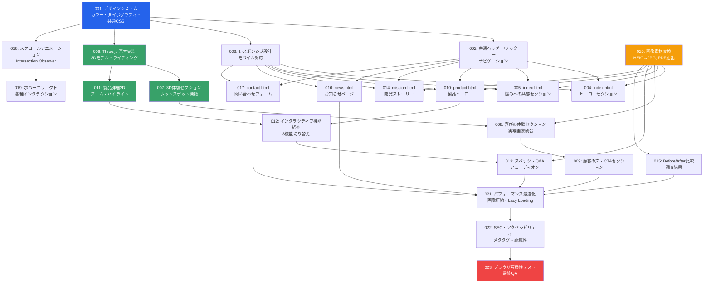

# チケット概要と依存関係図

## プロジェクト概要

FitWith Carry-Assist プロダクトマーケティングサイトの統合開発を、機能ごとにチケット化して並行開発を実施します。

## 開発フェーズと依存関係図



## チケット一覧

### 🎨 フェーズ1: 基盤構築（優先度: 最高）
- **001-design-system.md** - デザインシステム（カラー・タイポグラフィ・共通CSS）
- **002-common-header-footer.md** - 共通ヘッダー/フッター/ナビゲーション
- **003-responsive-design.md** - レスポンシブ設計基盤

### 🏠 フェーズ2: index.html（優先度: 高）
- **004-index-hero.md** - ヒーローセクション
- **005-index-empathy.md** - 悩みへの共感セクション
- **006-threejs-core.md** - Three.js 基本実装
- **007-index-3d-experience.md** - 3D体験セクション
- **008-index-joy.md** - 喜びの体験セクション
- **009-index-testimonial-cta.md** - 顧客の声・CTAセクション

### 🔧 フェーズ3: product.html（優先度: 高）
- **010-product-hero.md** - 製品ヒーロー（3Dミニビューワー）
- **011-product-3d-detail.md** - 製品詳細3D実装
- **012-product-features.md** - インタラクティブ機能紹介
- **013-product-specs-faq.md** - スペック表・Q&Aセクション

### 💭 フェーズ4: その他ページ（優先度: 中）
- **014-mission-story.md** - 開発ストーリーページ（mission.html）
- **015-mission-research.md** - Before/After比較・調査結果
- **016-news.md** - お知らせページ（news.html）
- **017-contact.md** - 問い合わせページ（contact.html）

### ✨ フェーズ5: インタラクション（優先度: 中）
- **018-scroll-animations.md** - スクロールアニメーション（Intersection Observer）
- **019-hover-effects.md** - ホバーエフェクト・各種インタラクション

### 📸 フェーズ6: アセット（優先度: 高）
- **020-asset-conversion.md** - 画像素材変換（HEIC→JPG、PDF抽出）

### 🚀 フェーズ7: 最適化（優先度: 中）
- **021-performance.md** - パフォーマンス最適化（画像圧縮・Lazy Loading）
- **022-seo-accessibility.md** - SEO・アクセシビリティ対応
- **023-browser-testing.md** - ブラウザ互換性テスト・最終QA

## 並行開発の推奨グループ

### グループA（基盤 - 最優先）
- 001, 002, 003 を順次実施

### グループB（並行可能 - 001-003完了後）
- 004, 005, 020（画像変換）
- 010, 014, 016, 017

### グループC（3D実装 - 006完了後）
- 007, 011

### グループD（コンテンツ統合 - グループB, C完了後）
- 008, 009, 012, 013, 015

### グループE（最適化 - 全コンテンツ完了後）
- 018, 019, 021, 022, 023

## 重要な依存関係

1. **001 デザインシステム** は全チケットの基盤
2. **002 共通ヘッダー/フッター** は全ページの前提
3. **003 レスポンシブ設計** は全ページの前提
4. **006 Three.js基本実装** は 007, 011 の前提
5. **020 画像素材変換** は各コンテンツセクションの前提

## 開発期間の目安

- **フェーズ1（基盤）**: 1-2日
- **フェーズ2（index.html）**: 3-4日
- **フェーズ3（product.html）**: 2-3日
- **フェーズ4（その他ページ）**: 2日
- **フェーズ5（インタラクション）**: 1-2日
- **フェーズ6（アセット）**: 1日（並行可能）
- **フェーズ7（最適化）**: 1-2日

**合計: 約11-16日**（並行開発により短縮可能）

## チケット管理ルール

各チケットには以下のセクションを含みます：

```markdown
# [チケット番号] チケット名

## 概要
（チケットの目的と成果物）

## 依存関係
- 前提: [チケット番号リスト]
- ブロック: [このチケットが完了しないと進めないチケット]

## Todo
- [ ] タスク1
- [ ] タスク2
- [ ] タスク3

## 実装詳細
（具体的な実装内容）

## 完了条件
- [ ] 条件1
- [ ] 条件2

## ステータス
- [ ] 未着手
- [ ] 作業中
- [ ] レビュー待ち
- [ ] 完了
```

## 次のステップ

1. 各チケットファイルを作成
2. 001-003（基盤）から順次着手
3. 並行開発可能なチケットを複数の開発者/Claude Codeインスタンスで実施
4. 各チケット完了時にTodoを更新

---

© 2024 FitWith Carry-Assist Development Team
